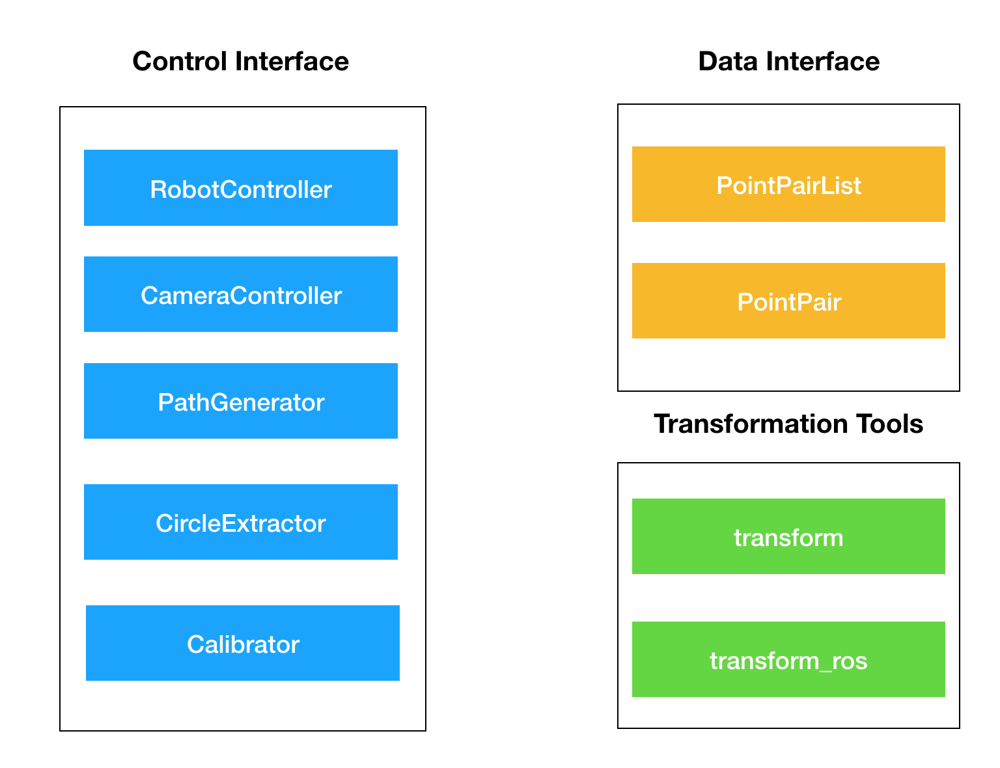

# Install 

## Dependencies

- `numpy`
- `yacs`
- `transforms3d`
- `open3d`


## Installation

- cd to `/bionic_dl/`
- `sudo python setup.py build`
- `sudo python setup.py install


# Overview



To support more robot & camera & calibration algorithms, just implement interfaces.

# Data Interface

```python
# Definition: /calib_toolbox/utils/piont_pair.py
class PointPair:
	def __init(self, index, p_robot, p_camera):
		p_robot = p_robot
		p_camera = p_camera
		extra_field = {} # extra information stored in dictionary
	
  def add_field(field, data) # add extra data into dictionary of extra_field
  
  def get_field(field, data) # get data from field
 
  def to_json()# convert information to a dictionary without numpy array
  
  def get_mat():
    return self.p_robot, self.p_cam
  
class PiontPairList:
  def __init__(self):
    self.pp_list = {}
    self.used_idx = [] # store used indicies when obtaining random list
    
  def read_old_data(file_path)
  
  def read(file_path)
  
  def write_data(file_path)
  
  def write_result(file_path, H)
  
  def get_len() # get total length of pp_list
  
  def get_mat(num_piont=4, idx_list=[]) # get random 4 by i matrix with required num_point or get 4 by i matrix with required index
  
  def get_mat_full() # get the full matrix of p_robot and p_camera 
  
  def circle_extraction() # apply circle extraction and update to pplist
```


# Component Interface

```python

# All pose used for inter-system communication is represented in a numpy array:
# 	pose_vec = [position, quat] = [x, y, z, q_w, q_x, q_y, q_z], dtype=np.array
# Conversion to other format should be done in controller components

# Definition: /calib_toolbox/robot_controller
class RobotController:
  __init__() # set up necessary compoment, e.g. moveit group
  move(pose_vec) # move robot end-actuator to required pose
  get_curr_pose(): return pose_vec # return current pose of robot end-actuator
  
# Definition: /calib_toolbox/cam_controller
class CameraController:
	__init__() # set up necessary component, e.g. script path
  get_image(im_path) # obtain point clouds with camera, and save to required path
 
# Definition: /calib_toolbox/path_generator/path_generator.py
class PathGenerator:
  __init__() # generate path and store in some list 
  get_waypint_next(): return pose_vec # return next pose for robot end-actuator, return empty numpy array if reaches the end of path
  
# Definition: /calib_toolbox/calibration/circle_fitting_main.py
class CircleExtractor:
  __call__(point_cloud_dir): return p_camera # return position of circle extracted if sucess, return empty numpy array if fails
  
# Definition: /calib_toolbox/calibration/calib_main.py
class Calibrator:
  __call__(point_pair_list): return H_final # input a PointPairList instance, return 4 by 4 H matrix in numpy array
```


# Example code

## Data collection & online callibtraion 

**Related file:** `/bionic_dl/scripts/calib.py`

## Offline calibration 

**Related file:**`/bionic_dl/scripts/test.py`


# Notification

- Data is stored in original unit. Be careful of the unit when apply calibration.

- Use config file instead of hardcode 

- - Check ‘calib_toolbox.config.defaults.py’ to see all config parameters or add your own config.


